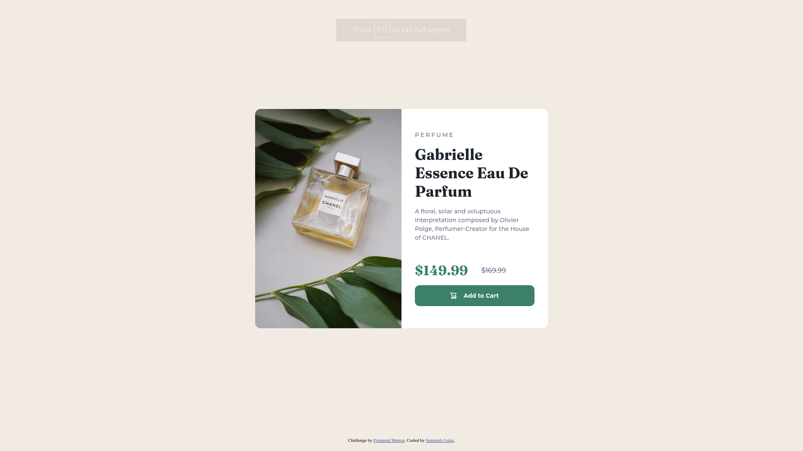

# Frontend Mentor - Product preview card component solution

This is a solution to the [Product preview card component challenge on Frontend Mentor](https://www.frontendmentor.io/challenges/product-preview-card-component-GO7UmttRfa). Frontend Mentor challenges help you improve your coding skills by building realistic projects. 

## Table of contents

- [Overview](#overview)
  - [The challenge](#the-challenge)
  - [Screenshot](#screenshot)
  - [Links](#links)
  - [Built with](#built-with)
- [Author](#author)

## Overview

Product preview card component

### The challenge

Users should be able to:

- View the optimal layout depending on their device's screen size
- See hover and focus states for interactive elements

### Screenshot

Desktop view

Mobile view

### Links

- Solution URL: [Solution URL here](https://www.frontendmentor.io/solutions/product-preview-card-component-OcXZTKu9rU)
- Live Site URL: [Live site URL here](https://773881df.product-preview-card-component-75h.pages.dev/)

### Built with

- Semantic HTML5 markup
- CSS custom properties
- Flexbox
- CSS Grid
- Mobile-first workflow

## Author

- Frontend Mentor - [@somu-code](https://www.frontendmentor.io/profile/somu-code)
- Twitter - [@GoluiSomnath](https://www.twitter.com/GoluiSomnath)